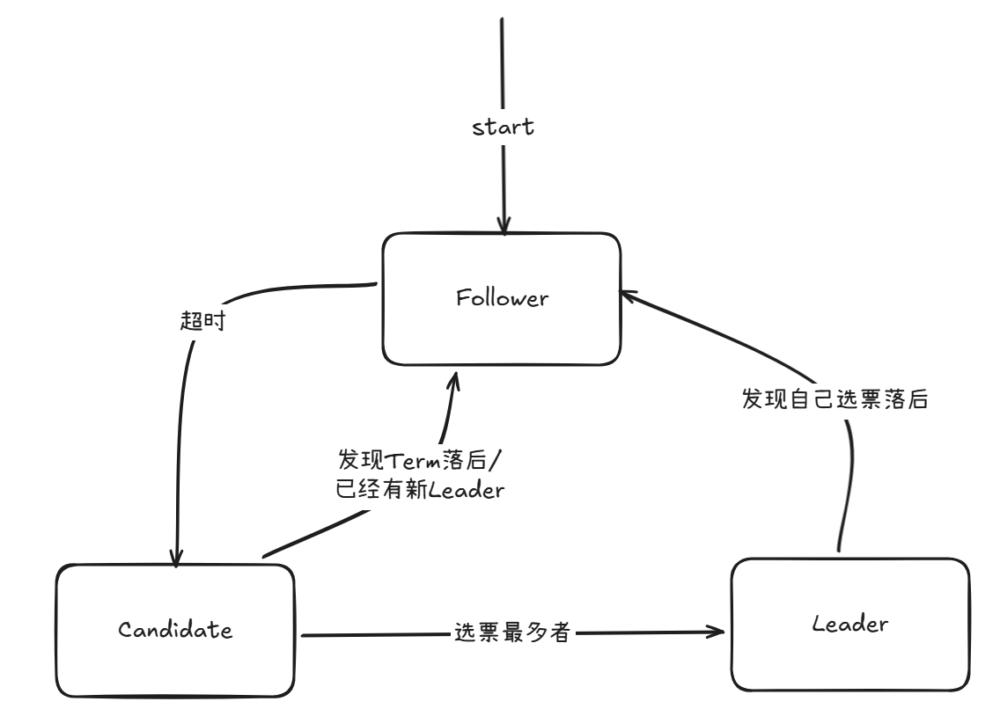
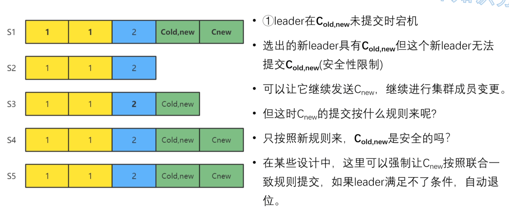
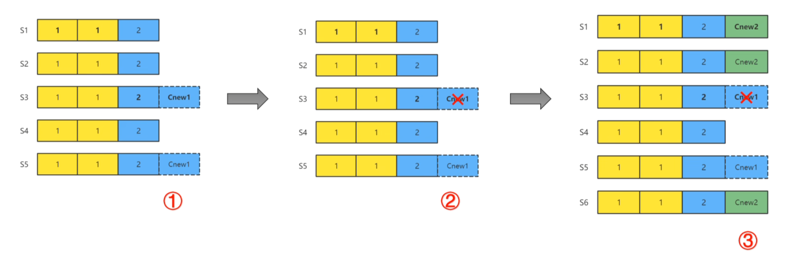
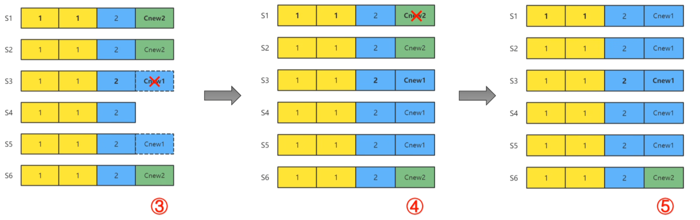

## 基本原理
Raft算法是分布式算法中的一种强一致性算法，其将分布式系统中所有节点分为Follower追随者、Candidate候选者、Leader领导者：

1. Follower：被动响应领导者的心跳和日志复制请求
2. Candidate：选举过程中的临时角色，由超时的Follower转换而来
3. Leader：处理所有客户端请求，负责日志复制。同一时刻有且仅有一个

   
## Leader选举：
#### term 任期：

一个逻辑时钟概念，**用连续递增的整数表示**。**每次选举都会开启一个新的任期**，**每一段任期从一次选举开始**，在某些情况下，一次选举无法选出Leader，这一任期会以没有Leader而立马结束，并开启下一次任期并再次选举。

任期用于**帮助节点识别过期的消息和领导者**。节点通信时会交换当前任期号，如果某个节点发现自己的任期号比收到的任期号小，则会更新自己的任期号为大值；如果一个节点收到一个包含过期任期号的请求，则会直接拒绝这个请求。

#### 心跳机制：

Raft实现了一种心跳机制，Leader通过发送心跳来告知所有Follower当前有Leader，如果Follower在一段时间内没有收到心跳，就会开始进行选举。

**Raft的心跳是一种特殊的 AppendEntries RPC，无日志体**

#### 选举：

1. 所有节点初始化都为Follower，通过心跳机制去判断有无Leader，若心跳机制超时，代表没有Leader，则该节点先增加自己的当前任期号，并将自己变为Candidate。
2. 成为Candidate的节点首先投票给自己，再向其他 Follower 发起投票请求（即后述RequestVote RPC），多个Candidate通过随机事件来避免同时选票，当某个Candidate获得的票数**超过节点数的一半**时成为Leader。
3. 成为Leader的节点开始日志同步、日志提交等操作，并发送心跳给所有Follower。
4. 收到新Leader心跳的Candidate会检查新Leader的任期号，如果新Leader的任期号不小于自己的任期号（正常情况下是相等），则拥护新Leader，将自己降为Follower。

  

#### 随机选举超时时间：

如果在一个任期内没有任何一个Candidate得票数超过半数，则每个Candidate在等待一个在一定范围内随机的选举超时时间后，默认再次发起选举。

#### 投票：

每个Follower节点有一个选票，采用**先来先得**的策略投票（成为Candidate的节点不参与投票，因为他们已经把票投给自己了）。

投票条件：
1. 发起投票请求的Candidate的任期号是否大于自己的任期号
2. 自己的lastLogIndex和lastLogTerm比Candidate的新


#### RPC通信：

Raft算法中，服务器节点之间通过RPC协议进行通信，有两种主要的RPC：
1. RequestVote RPC：请求投票，由Candidate在选举期间发起
2. AppendEntries RPC：追加条目，由Leader发起，用来复制日志和提供心跳。

```c++
// RequestVote RPC Request
struct RequestVoteRequest{
    int term;   // 自己当前的任期号
    int candidateId;    // 自己的ID
    int lastLogIndex;   // 自己最后一个日志号
    int lastLogTerm;    // 自己最后一个日志的任期
}

// RequestVote RPC Response
struct RequestVoteResponse{
    int term;   // 自己当前的任期号
    bool voteGranted;   // 自己会不会投票给这个Candidate
}
```


#### 客户端如何得知哪个是Leader节点？
有三种情况：

1. 客户端找到的节点就是Leader：直接执行指令
2. 客户端找到的节点是Follower：通过心跳机制告知客户端去找Leader节点
3. 客户端找到的节点宕机了：客户端找另一个节点

## Raft日志
#### 日志：

日志在Raft中用于**保存客户端请求命令**，是实现一致性的核心载体。Raft让多个节点的上层状态机保持一致的关键时让各节点的日志保持一致。

#### 日志条目：

每个日志条目包含三个重要信息：
1. 索引：日志条目的唯一顺序编号，即日志号
2. 任期号：创建该条目时的任期信息
3. 命令：客户端请求的操作指令

- 注意：**索引和任期号两个因素才可唯一确定一个日志，缺一不可**

#### 日志复制：

Leader收到客户端的指令后，会把指令作为一个新的日志条目追加到日志中去，接着**并行发送**AppendEntries RPC给所有Follower，让他们复制该条目。

#### 日志提交：

**Leader提交：**
当**超过半数的Follower复制**后，Leader就在本地执行该指令并把结果返回客户端，本地执行指令并返回给客户端称作**日志提交**。

```c++
// AppendEntries RPC Request
struct AppendEntriesRequest{
    int term;   // 自己当前的任期号
    int leaderId;   // Leader（自己）的ID
    int prevLogIndex;    // 前一个日志条目的日志号
    int prevLogTerm;    // 前一个日志的任期号
    char[] entry;   // 当前日志体
    int leaderCommit;   // Leader已经提交的日志号
}

// AppendEntries RPC Response
struct AppendEntriesResponse{
    int term;   // 自己当前任期号
    bool success;   // 如果Request的term大于自己的term且Follower包括前一个日志，则返回true
}
```
**Follower提交：**
Leader通过心跳（特殊的AppendEntries RPC）或者AppendEntries RPC中的leaderCommit字段来通知Follower，int leaderCommit 的作用：Leader将自己已经提交的最后一个日志条目的日志号传递给Follower，然后Follower就可以将leaderCommit之前已经复制的日志条目进行提交。


#### 一致性保证：

在日志复制过程中，Leader和Follower随时都有崩溃或缓慢的可能性，Raft必须保证在有宕机的情况下，保证每个副本日志顺序的一致。具体有三种可能：

1. 如果Follower由于某些原因（网络延迟等）没有给Leader响应，那么Leader会不断重发追加条目请求，无论Leader是否已经回复了客户端；
2. 如果Follower宕机后恢复，这时**一致性检查生效**，保证Follower能够按照顺序恢复宕机期间缺失的日志；
3. 如果Leader宕机，那么宕机的Leader节点可能已经复制了日志到部分Follower（**不过半数，还没达到提交条件**）但**还没有提交**，而被选出的新Leader又可能不具备这些日志，这样就会导致部分Follower中的日志和新Leader中的日志不一致。在这种情况下，Leader通过一致性检查找到Follower中最后一个跟自己一致的条目，这个条目之后，Leader强制Follower复制它的日志来解决不一致问题（这意味着Follower中跟Leader冲突的日志条目会被舍弃）（注意：这与后述安全性第二点不同，这里是还未复制过半，还未达到提交条件）

#### 一致性检查：

Leader在每一个发往Follower的追加条目RPC中，会放入前一个日志条目的索引位置和任期号，如果Follower找不到前一个日志条目，那么它会拒接，Leader收到Follower的拒绝信息后，会发送前一个日志条目的索引，从而逐渐向前定位到Follower第一个缺失的日志。

优化：默认的一致性检查是线性查找，时间复杂度为O(n)，可以优化为让Follower返回自己的最后一个日志条目的索引和任期，或者优化为二分查找


#### 疑问

若Leader在过半数Follower复制日志后提交日志，接着在提交日志后宕机，那么那些未复制日志的Follower的日志（多）与新Leader的日志（少）不一致怎么办，如果按照一致性检查找到Follower中最后一个跟自己一致的条目，在这个条目之后，Leader强制Follower复制它的日志来解决不一致问题，那么Follower中那些已经提交的日志条目不久丢失了吗？这类宕机问题是如何处理的？

## 安全性
领导者选举和日志复制两个子问题实际上已经涵盖了共识算法的全程，但这两点还不能完全保证每一个状态机会按照相同的顺序执行相同的命令。所以Rft通过几个补充规则完善整个算法，使算法可以在各类宕机问题下都不出错。
这些规则包括（不讨论安全性条件的证明过程）：
1. Leader宕机处理：**选举限制**
    
    这个就是为了处理疑问中描述的场景，确保选出来的Leader包含了之前所有任期的所有被提交的条目。选举限制是通过RequestVote RPC Request中的lastLogIndex（Candidate的最后一个日志号）和lastLogTerm（Candidate最后一个日志的任期）来实现的：

    **投票者（即Follower）会检查这两个字段，若自己的日志比Candidate的日志还要新，就会拒绝该投票请求。先比较任期号，再比较日志号（比较顺序不能变）。**

2. Leader宕机处理：新leader是否提交之前任期内的日志条目

    如果某个Leader在提交之前（已经复制过半，达到了提交条件）宕机了，选举出的新Leader会试图完成未提交日志条目的复制，注意**只复制不提交，Raft永远不会通过计算副本数目的方式来提交之前任期内未提交的日志条目**。

    那么之前任期内的日志条目如何提交？通过提交当前任期的新日志来**间接提交**该旧日志。具体请看**no-op补丁**章节。
3. Follower和Candidate:宕机处理

    如果Follower和Candidate宕机了，那么后续发给他们的RPC都会失败，Raft通过无限重试来处理这种失败，一旦宕机的机器重启了，那么这些RPC就会成功完成。
4. 时间与可用性限制

    **如果一次网络来回的时间大于选举超时时间，那么就永远选不出Leader**。

    **如果系统宕机特别频繁，每次宕机的间隔要短于选举超时时间，这时会出现永远也完成不了选举的情况**。

    即：广播时间(broadcastTime)<<选举超时时间(electionTimeout)<<平均故障时间(MTBF)

## 集群成员变更
集群成员变更指的是增删节点，替换宕机的机器或者改变复制的程度等会改变集群配置的操作。Raft可以进行**集群配置变更自动化**。

自动化变更配置机制的最大的难点是保证转换过程中不会出现同一任期的两个leader,因为转换期间整个集群可能划分为两个独立的大多数。这就是分布式系统中经典的**脑裂问题**。

#### 两阶段方法和联合一致状态：

1. 第一阶段：Leader发起 C<sub>old,new</sub>，使整个集群达到联合一致状态。这时，所有RPC都要在新旧两个配置中都达到大多数复制才算成功。
2. 第二阶段：Leader发起 C<sub>new</sub>，使整个集群进入新配置状态。这时，所有RPC只要在新配置下达到大多数复制就算成功。因为 C<sub>new</sub> 发起意味着 C<sub>old,new</sub> 已经复制到了大多数节点，不需要再管老配置了。
   
C<sub>old,new</sub>和 C<sub>new</sub> 将配置信息作为一个日志体，包装在一个AppendEntries RPC Request中，发送给所有的Follower。一旦某个节点将C<sub>old,new</sub> 或 C<sub>new</sub> 复制到自己的日志中，它就会利用该配置来做出未来所有的决策（**服务器总是使用它日志中最新的配置，无论该配置日志是否已经被提交**）。这意味着Leader不用等待C<sub>old,new</sub> 或 C<sub>new</sub> 返回，就会直接使用新规则来做出决策。

#### 状态变更时的宕机情况：
1. Leader在 C<sub>old,new</sub> 未提交时宕机
2. Leader在 C<sub>old,new</sub> 已提交，C<sub>new</sub> 未发起时宕机
3. Leader在 C<sub>new</sub> 已发起后宕机

上面三种宕机情况会因为安全性限制而保证安全，但是有一个例外：



#### 补充规则：
1. 新增节点时，需要等待新增的节点完成日志同步再开始集群成员变更
2. 缩减节点时，leader本身可能就是要缩减的节点，这时它会在完成 C<sub>new</sub>的提交后自动退位。在发起C<sub>new</sub>后，要退出集群的leader就会处在操纵一个不包含它本身的raft集群的状态下。这时它可以发送C<sub>new</sub>日志，但是日志计数时不计自身。
3. 为了避免下线的节点超时选举而影响集群运行，服务器会在它确信集群中有leader存在时拒绝Request Vote RPC.因为C<sub>new</sub>的新leader不会再发送心跳给要退出的节点，如果这些节点没有及时下线，它们会超时增加任期号后发送Request Vote RPC。虽然它们不可能当选leader,但会导致raft集群进入投票选举阶段，影响集群的正常运行。为了解决这个问题，Raft在Request Vote RPC上补充了一个规则：一个节点如果在最小超时时间之内收到了Request Vote RPC,那么它会拒绝此RPC。这样，只要follower:连续收到leader的心跳，那么退出集群节点的Request Vote RPC就不会影响到 raft集群的正常运行了。


## 深入理解
#### Raft共识算法的三个主要特性：
1. 共识算法可以保证在任何非拜占庭情况下的正确性。所谓拜占庭情况就是节点发送错误的命令或使坏。
2. 共识算法可以保证在大多数机器正常的情况下集群的高可用性，而少部分的机器缓慢不影响整个集群的性能。    
3. 不依赖外部时间来保证日志的一致性。

#### Raft区别于其他共识算法的三个特征：
1. Strong Leader：在Raft中，日志只能从Leader流出。但是这也会导致性能问题，因为需要保证选举出的Leader需要具备最新日志。
2. Leader election：Raft使用随机计时器进行Leader选举。这只需要在心跳机制上增加少量机制即可实现
3. Membership changes：Raft使用一种**联合一致**的方法来处理集群成员变更的问题，变更时，两种不同的配置的大多数机器会重叠，这允许整个集群在配置变更期间仍然可以正常运行。

#### no-op补丁：
一个节点当选leader后，立刻发送一个自己当前任期的空日志体的AppendEntries RPC。这样，就可以把之前任期内**满足提交条件**的日志都提交了（根据上述安全性规则，未满足提交条件的日志被覆盖）。一旦no-op完成复制，就可以把之前任期内符合提交条件的日志保护起来了，从而就可以使它们安全提交。因为没有日志体，这个过程应该是很快的。目前大部分应用于生产系统的raft算法，都是启用no-op的。

#### 单节点集群成员变更方法：
联合一致集群成员变更方法实现复杂，不契合Raft的易理解性。目前大多数Raft实现都使用单节点集群成员变更方法，即一次只增减一个节点，相比于多节点增减，单节点增减的最大差异是**新旧配置集群的大多数一定会重合**，因此**选不出两个Leader**，从而不需要使用联合一致状态中继，可以**直接从旧配置转到新配置**。

#### 单节点集群成员变更方法的缺陷：
1. 不支持一步完成机器替换
2. 单节点集群成员变更方法必然经历偶数个节点的集群状态，这会降低集群的高可用性。当集群有偶数个节点时，若均分为两块且各自属于不同的网络分区，那么就会出现选不出Leader的情况。

    解决办法：优化偶数节点集群，有以下两种思路：
    1. 引入预投票阶段：在正式选举前增加一个预投票环节，节点需先获得多数派的预投票同意，才能增加任期号并发起正式选举。这有效防止了由于网络分区或节点恢复而产生的“任期号爆炸式增长”​ 问题；
    2. 临时允许由新、旧配置交集节点组成的、且彼此间必然存在重叠的特定节点子集，被视为达成集群共识的有效多数派。这保障了在可能出现网络分区时，包含该子集的分区仍能继续提供服务，同时由于这些子集源于配置交集且满足成对重叠的特性，系统的一致性（防止脑裂）依然严格满足。
3. 连续的两次变更，第一步变更的过程中如果出现了且切主，那么紧跟的下一次变更可能出现错误，示例解释如下：
    
    
    如图，考虑从S1~S4的四节点集群连续两次扩容到S1~S6六节点集群的情况，第一次增加S5节点，此时Leader为S3,S3复制C<sub>new</sub>1 到S5，然后S3宕机，重新选举出S1为新Leader，此时由于S1并没有C<sub>new</sub>1 条目，因此，S1不知道集群中添加了S5，而是继续执行添加S6的操作，S1在将C<sub>new</sub>2 复制到S2和S6中构成提交条件后将C<sub>new</sub>2 提交，而S5的C<sub>new</sub>1 却并没有被提交。此时S1不知道集群中有S5，S3不知道集群中有S6。接着S1宕机，S3恢复并依靠345的选票当选Leader，当选后，S3会继续复制C<sub>new</sub>1到除了S6以外的所有节点，根据一致性保证，S3会使用C<sub>new</sub>1 将S1和S2中已提交的C<sub>new</sub>2覆盖，造成严重bug。

    解决办法很简单：强制新Leader必须提交一条自己任期内的no-op日志，才能开始单节点集群成员变更。这样，在上图中S1当选新Leader后，使用no-op把未提交的C<sub>new</sub>1 覆盖掉，再开始 C<sub>new</sub>2 的复制，就不会出现问题。

#### 日志压缩机制：
随着集群的运行，Raft上各节点的日志也在不断累积，需要安全清理日志。Raft采用的是一种**快照技术**，每个节点在达到一定条件之后，可以把当前日志中的命令都写入自己的快照，然后就可以把已经并入快照的日志都删除了。**快照中一个key只会留有最新的一份value**,占用空间比日志小得多。如果一个Follower落后，且leader的日志被清理了，那么Leader将**直接向Follower发送快照**来实现日志同步

#### 线性一致性读与只读操作处理：
线性一致性读的定义：读到的结果要是读请求发起时最新提交的结果。

要追求线性一致性读，需要让读请求也达到共识，稳妥的办法是将读请求也作为日志，这样读到的结果一定是符合线性一致性的，但是代价太大了。

优化方法需要符合以下规则：
1. 线性一致性读一定要发往Leader。如果客户端给Follower发了读请求，那么Follower也要将读请求转发给Leader；
2. 如果一个Leader在它的任期内还没有提交一个日志，那么它要在提交一个日志后才能反馈客户端读请求。因为只有在自己任期内提交了一个日志，Leader才能够确认之前任期的哪些日志已被提交，才不会出现已提交的数据读取不到的情况；
3. 在进行读操作前，Leader要向所有节点发送心跳以确保自己仍然是Leader
4. Leader把自己已提交的日志号设置为readIndex，只要Leader应用到了readIndex的日志，就可以查询状态机结果并返回给客户端了

如果不要求强线性一致性读，可以通过读备库（读Follower）来利用Follower承载更大的读压力，但可能读不到最新的数据。

#### 优化方案：
1. 合理设置选举超时时间，减少选举和维持Leader所需的代价
2. 采用批处理优化日志复制，节省网络。一个日志条目可包含多个指令
3. 使用流水线机制，让Leader不用等待Follower的回复，就继续给Follower发送下一个日志
4. Multi-Raft：将数据分组，每组数据独立，用自己的raft来同步

## Raft与Paxos比较
Raft不允许日志空洞，Paxos允许，Raft的性能没有Paxos好；但是大多数系统实现是无法达到raft的上限的，所以暂时无需担心raft本身的瓶颈。

## Raft允许日志空洞的改造版本——ParallelRaft
#### Raft的两点限制：
1. log复制的顺序性：Raft的follower如果接收了一个日志，意味着它具有这个日志之前的所有日志，并且和leader完全一样。
2. log提交（应用）的顺序性：Rat的任何节点一旦提交了一个日志，意味着它已经提交了之前的所有日志。

ParallelRaft就打破了这两点规则，实现对日志的乱序确认和乱序提交，以满足现代系统对于并发性的要求。

#### 乱序确认与乱序提交：
- 乱序确认（Out-of-Order Acknowledge):ParallelRaft中，任何log成功持久化后立即返回 success,无需等待前序日志复制完成，从而大大降低系统的平均延迟。
- 乱序提交(Out-of-Order Commit):ParallelRaft中，leader在收到大多数节点的复制成功信息后，无需等待前序日志提交，即可提交当前日志。

#### look behind buffer机制：
为了避免乱序提交带来的“**旧数据覆盖新数据**”的问题，引入一种look behind buffer的数据结构，ParallelRaft的每个log都附带有一个look behind buffer。look behind buffer存放了前N个log修改的**LBA(逻辑块地址)**信息。当一个Follower节点收到一条日志（索引为i）并准备将其应用到状态机时，即便i之前的某些日志还没有收到，即形成了日志空洞，它也可以进行检查：

节点会查看日志 i 附带的 look behind buffer，检查它计划修改的数据范围是否与 buffer 中记录的、位于它之前的 N 条日志的修改范围是否有重叠。若有重叠，说明有冲突，那么这条日志条目会被放入一个**pending队列**暂存，直到与他发生冲突的所有前置日志都成功应用后再执行。

#### Leader Candidate机制：
日志空洞会有一个直接影响：怎样选举出具有完整日志的Leader？ParallelRaft把选出来的主节点定义为Leader Candidate,Leader Candidate.只有经过一个**Mergel**阶段，**弥补完所有日志空洞**后才能开始接收并复制日志。其选举规则与Raft略有差异：

ParallelRaft在选举阶段会选择具有最新**checkpoint**的状态机的节点当选Leader Candidate。

#### Merge阶段：
Merge阶段总体流程：
1. Follower Candidate发送自己的日志（应该是checkpoint之后的所有日志）给Leader Candidate。 Leader Candidate 把自己的日志与收到的日志进行Merge；
2. Leader Candidate同步状态信息（推测应该是具体选择哪些log）给Follower；
3. Leader Candidate提交所有日志并通知Follower Candidate提交；
4. Leader Candidate升级为Leader,并开始自己任期内的服务。

我们把所有日志分为3类：
1. 已经提交的日志：一定要在Leader Candidate上补上空洞并提交；对于索引相同但任期号不同的日志条目，要选择任期号最大的那个；
2. 未提交的日志（在任何节点上都未提交过，或确定在大多数节点上都没有的日志（拥有这个日志的节点数+宕机的节点数<不包含这个日志的节点数））：这类日志若Leader Candidate上没有，就可以用空日志替代；
3. 不确定是否提交的日志（拥有这个日志的节点数+宕机的节点数 >= 不包含这个日志的节点数）：为了保证安全，Leader Candidate要提交这个日志。

Merge阶段的引入导致选举的代价变得很大，但是选举不经常发生，所以性能消耗在可接受范围内。

#### checkpoint：
ParallelRaft的checkpoint就是**状态机的一个快照**。在实际实现中，ParallelRaft会选择有最新 checkpoint的节点做 Leader Candidate,而不是拥有最新日志的节点，有两个原因：
1. Merge阶段时，Leader Candidate可以从其它节点获取最新的日志，并且无需处理checkpoint:之前的日志。所以**checkpoint越新，Merge阶段的代价就越小**。
2. Leader的checkpoint越新，catch up时就更高效。

#### catch up机制：
ParallelRaft:把落后的Follower 追上Leader的过程称为catch up,有两种类型：
 1. fast-catch-up:Follower和Leader差距较小时（差距小于上一个checkpoint）,仅同步日志。 
 2. streaming-catch-up:Follower和Leader差距较大时（差距大于上一个checkpoint）,同步 checkpoint 和日志。