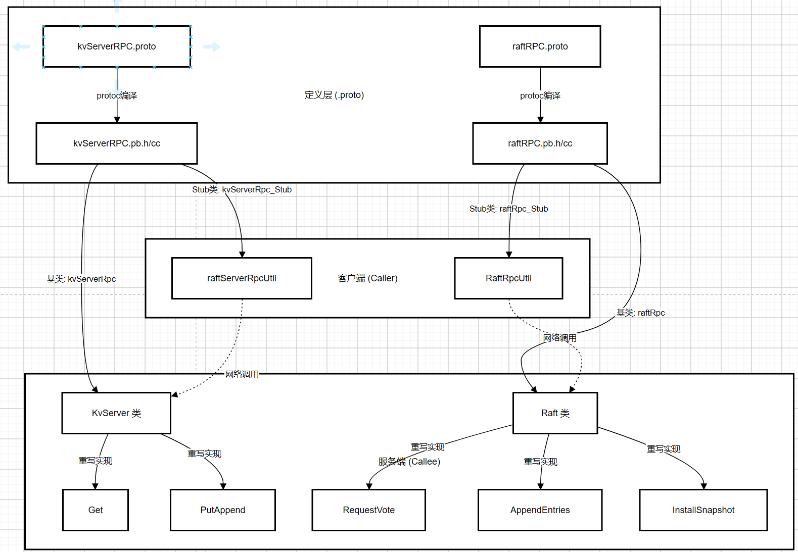

## 概述
这是一个自定义的 RPC 框架核心实现，基于 Google Protobuf 和 Muduo 网络库 构建。

## 代码结构
### 协议与配置层
#### rpcheader.proto：
- 作用：定义RPC通信协议的数据头协议
- 内容：
  - service_name：要调用的服务名
  - method_name：要调用的方法名
  - args_size：参数体的序列化长度
- 必要性：网络传输是字节流，需要告诉接收方**从哪里到哪里是服务名，从哪里到哪里是参数**

#### mprpcconfig：
- 作用：配置文件解析器
- 功能：读取.conf配置文件(如IP、端口等)，解析成KV格式存入map
- 目的：
  1. 避免硬编码，动态读取服务器地址
  2. 实现服务发现和连接：客户端和服务端通过配置文件发现并获取其他节点的网络地址,建立RPC连接
- 配置文件：配置文件 test.conf 是程序运行时在rpcprovider中动态生成的，每个Raft节点启动时，会将自己的node(index)ip和node(index)port追加写入test.conf文件。内容格式：
    ```
    node0ip=127.0.0.1
    node0port=8000
    node1ip=127.0.0.1
    node1port=8001
    node2ip=127.0.0.1
    node2port=8002
    ```

### 控制与传输层
#### mprpccontroller：
- 作用：RPC调用的状态控制器（实现了 google::protobuf::RpcController 接口）
- 核心功能：
  - Failed()：检查RPC调用是否失败（区分网络传输失败 vs 业务逻辑失败）
  - SetFailed()：设置错误状态和错误信息
  - ErrorText()：获取错误详情
- 使用场景：客户端调用后通过 controller.Failed() 判断网络层是否出错

#### mprpcchannel：
- 作用：**客户端核心**。RPC客户端的通信渠道（实现了 google::protobuf::RpcChannel 接口）
- 核心方法 **CallMethod()**：
  - 序列化请求：将RPCHeader和request 打包成字节流
  - 网络发送：通过TCP Socket发送给服务端
  - 接收响应：阻塞等待服务端返回
  - 反序列化：将字节流还原成response对象
- 编码格式：[header_size(变长)] + [RpcHeader序列化数据] + [args序列化数据]
- 关键特性：支持断线重连、长连接

### 服务端核心
#### rpcprovider：
- 作用：RPC 服务端框架，负责发布和处理远程调用
- 核心方法：
  - NotifyService(): 注册本地服务（将服务和方法的描述符存入 map）
  - Run(): 启动网络服务，监听端口，进入事件循环
  - OnMessage(): 收到 RPC 请求时的回调，该回调需要实现以下功能：
    1. 解析请求头
    2. 反序列化参数
    3. 查找本地服务对象和方法
    4. 调用 service->CallMethod() 执行业务逻辑
    5. 通过 done->Run() 触发响应发送
  - SendRpcResponse(): 序列化响应并通过网络返回
- 网络层：基于 Muduo 库的 TcpServer，支持多线程

## 客户端和服务端场景1 —— 客户端 <-> KV服务器
#### 客户端 —— Clerk
#### 服务端 —— KvServer
#### 传递的数据
定义在 **kvServerRPC.proto** 中：

```
request: GetArgs { key: "name" }
response: GetReply { value: "Alice", err: OK }

request: PutAppendArgs { key: "age", value: "18", op: "Put" }
response: PutAppendReply { err: OK }
```
#### 工作流程：
1. 客户端 Clerk 调用 Get("name")
2. 通过 mprpcchannel 将请求发送给某个 KvServer
3. KvServer 收到请求，通过 Raft 协议同步到集群
4. 返回结果给 Clerk

## 客户端和服务端场景2 —— Raft 节点之间的共识层通信
定义在 **raftRPC.proto** 中：
```
// 请求投票
RequestVoteArgs { term, candidateId, lastLogIndex, ... }
RequestVoteReply { term, voteGranted }

// 追加日志
AppendEntriesArgs { term, leaderId, entries[], ... }
AppendEntriesReply { term, success }

// 快照安装
InstallSnapshotArgs { term, leaderId, snapshot, ... }
InstallSnapshotReply { term }
```

## 框架完整执行流程：
```
┌─────────────────────────────────────────────────────────────┐
│ OnMessage (RPC 框架)                                         │
├─────────────────────────────────────────────────────────────┤
│ 1. 创建 request 和 response 对象                             │
│ 2. 创建 Closure，绑定 SendRpcResponse + conn + response      │
│ 3. 调用 service->CallMethod(..., done)                      │
│    ↓                                                         │
│    传递控制权给业务代码                                        │
└────────────────────┬────────────────────────────────────────┘
                     ↓
┌─────────────────────────────────────────────────────────────┐
│ UserService::Login (业务代码)                                │
├─────────────────────────────────────────────────────────────┤
│ 1. 处理业务逻辑（可能很慢）                                    │
│ 2. 填充 response 对象                                        │
│ 3. done->Run()  ← 触发回调                                  │
│    ↓                                                         │
│    控制权返回框架                                              │
└────────────────────┬────────────────────────────────────────┘
                     ↓
┌─────────────────────────────────────────────────────────────┐
│ SendRpcResponse (RPC 框架)                                   │
├─────────────────────────────────────────────────────────────┤
│ 1. 序列化 response                                           │
│ 2. 通过 conn 发送给客户端                                     │
│ 3. 清理资源（Closure 会自动 delete response）                 │
└─────────────────────────────────────────────────────────────┘
```

## RPC Stub
RPC Stub（桩）是RPC框架中客户端的代理对象，它封装了远程方法调用的细节，让你可以像调用本地函数一样调用远程服务。

Stub在编译proto文件时自动生成Stub类和Get、PutAppend方法。

该项目中有两种使用Stub的路径：
#### 客户端(Clerk) → KV服务器
系统中raftServerRpcUtil是对Stub的二次封装，其中封装了Get和PutAppend调用；

#### Raft节点之间
RaftRpcUtil也是对Stub的二次封装，其中封装了RequestVote和AppendEntries调用

## 补充
### ProtoBuf 协议
Protocol Buffers（简称 Protobuf）是一种高效的、跨平台的数据序列化协议，由 Google 开发并广泛应用于各种场景。通过使用 Protobuf 编译器（protoc），可以将定义好的 .proto 文件编译成多种编程语言的代码，从而方便地在项目中使用。


### RPC 协议定义
使用ProtoBuf进行网络通信协议RPC的定义。ProtoBuf 负责将复杂的、带有指针引用的、不连续的内存对象，“压扁”成一串标准的、连续的二进制字节流。接收方再把它“还原”成自己内存里的对象。这个过程叫**序列化 (Serialization) 和 反序列化 (Deserialization)**。

在代码中，定义传输消息只需要编写.proto文件，这是RPC通信的“合同”，定义通信双方的数据格式和服务接口。使用 ProtoBuf 的编译器 (protoc) 将.proto文件编译为二进制数据

mprpc 是对 protobuf RPC 框架的封装与实现，protobuf 本身只提供了接口框架：RpcChannel、RpcController、Service、Stub 等抽象类
序列化/反序列化：将消息对象与字节流互相转换
代码生成：根据 .proto 文件生成 Stub 和 Service 类。没有提供网络通信的实现，它故意留空，让开发者根据自己的需求（TCP/UDP/HTTP/共享内存等）去实现。

### Protobuf的反射实现原理
三层继承体系：
```
google::protobuf::Service (基类，定义了 CallMethod 纯虚函数)
          ↑
    UserServiceRpc (protoc 自动生成，重写 CallMethod 实现方法分发)
          ↑
      UserService (开发者实现，重写具体业务方法 Login/Register)
```

两级映射结构：
```
service_name ──→ m_serviceMap ──→ ServiceInfo
                                      ├── m_service (服务对象指针)
                                      └── m_methodMap
                                            └── method_name ──→ MethodDescriptor*
```

## RPC 深入解析报告：从 Proto 定义到代码实现

本报告旨在从开发者的角度，深入剖析系统中 RPC 模块的复杂结构，解释 `.proto` 文件的作用、ProtoBuf 编译后的产物、以及开发者需要手动实现的接口。

### 1. 系统核心 RPC 架构图解




### 2. Proto 文件详解：定义了什么？

系统中有三个核心 `.proto` 文件，它们是通信的“合同”。

#### (1) `src/rpc/rpcheader.proto` (通信头)
*   **用途**：框架内部使用的元数据。
*   **定义内容**：
    *   `RpcHeader`：并在每次 RPC 调用时随数据发送，包含 `service_name` (如 "kvServerRpc")、`method_name` (如 "Get") 和 `args_size` (参数长度)。
*   **作用**：让服务端收到字节流后，知道要把剩余的数据交给哪个类的哪个方法去处理。

#### (2) `src/raftRpcPro/kvServerRPC.proto` (KV业务)
*   **用途**：定义客户端 (Clerk) 与 KV服务器 (KvServer) 之间的通信接口。
*   **定义内容**：
    *   **消息 (Message)**：`GetArgs`, `GetReply`, `PutAppendArgs` 等结构体。
    *   **服务 (Service)**：`kvServerRpc`，声明了两个远程方法 `PutAppend` 和 `Get`。

#### (3) `src/raftRpcPro/raftRPC.proto` (Raft共识)
*   **用途**：定义 Raft 节点之间的共识算法通信接口。
*   **定义内容**：
    *   **消息**：`AppendEntriesArgs` (日志复制/心跳), `RequestVoteArgs` (投票请求) 等。
    *   **服务**：`raftRpc`，声明了三个核心方法 `AppendEntries`, `RequestVote`, `InstallSnapshot`。

---

### 3. ProtoBuf 编译后生成了什么？

当使用 `protoc` 编译 `.proto` 文件时，会生成对应的 `.pb.h` 和 `.pb.cc` 文件。对于每个定义的 `service`，会生成两个核心类：

#### A. Service 基类 (供服务端继承)
*   **类名**：`kvServerRpc` / `raftRpc`
*   **特点**：继承自 `google::protobuf::Service`。
*   **包含方法**：
    *   **虚函数接口**：`virtual void Get(...)`, `virtual void PutAppend(...)`。这些方法默认实现不仅会报错，**必须由子类重写**。
    *   **CallMethod**：这是框架调用的入口。它实现了根据方法名字符串（反射）分发到具体虚函数逻辑。
*   **你的工作**：编写 `KvServer` 和 `Raft` 类继承它们，并实现具体的业务逻辑。

#### B. Stub 类 (供客户端调用)
*   **类名**：`kvServerRpc_Stub` / `raftRpc_Stub`
*   **特点**：继承自对应的 Service 基类。
*   **包含方法**：实现了 `Get`, `PutAppend` 等方法。
*   **实现逻辑**：这些方法内部**不需要**你编写逻辑，它们会自动调用 `channel->CallMethod()`，将参数序列化并通过网络发送出去。
*   **作用**：像本地对象一样被调用，但在此时发生网络通信。

---

### 4. 开发者需要重写哪些方法？（服务端视角）

你需要创建 C++ 类继承生成的 Service 基类，并重写 `.proto` 中定义的 RPC 方法。

#### A. 在 `KvServer` 类中 (src/raftCore/kvServer.cpp)
继承自 `kvServerRpc`。

| 需要重写的方法 | 何时被调用 | 方法的作用 |
| :--- | :--- | :--- |
| **`Get`** | 当 Clerk 发起查询请求，RpcProvider 解析出 method="Get" 时 | 1. 接收 GetArgs (含 Key)<br>2. 将操作封装成 Op 传入 Raft 达成共识<br>3. 等待共识完成，从状态机/数据库读取 Value<br>4. 填入 GetReply 并返回 |
| **`PutAppend`** | 当 Clerk 发起写请求，RpcProvider 解析出 method="PutAppend" 时 | 1. 接收 PutAppendArgs (含 Key, Value, Op)<br>2. 将操作传入 Raft 达成共识<br>3. 等待应用到状态机<br>4. 返回执行结果 |

**代码示例**：
```cpp
// 必须严格按照 Proto 生成的签名重写
void KvServer::Get(google::protobuf::RpcController *controller, 
                   const ::raftKVRpcProctoc::GetArgs *request,
                   ::raftKVRpcProctoc::GetReply *response, 
                   ::google::protobuf::Closure *done) {
    // 1. 执行具体的业务逻辑
    // ...
    
    // 2. 告诉框架逻辑执行完毕，可以发送响应了
    done->Run(); 
}
```

#### B. 在 `Raft` 类中 (src/raftCore/raft.cpp)
继承自 `raftRpc`。

| 需要重写的方法 | 何时被调用 | 方法的作用 |
| :--- | :--- | :--- |
| **`RequestVote`** | 当其他节点竞选 Leader 发来投票请求时 | 判断是否给对方投票（比较 term 和 log完整性） |
| **`AppendEntries`** | 当 Leader 发送心跳或日志同步请求时 | 处理心跳维持 Leader 状态，或将新日志追加到本地日志中 |
| **`InstallSnapshot`** | 当 Leader 发送快照安装请求时 | 接收快照数据并应用，因为 Follower 落后太多无法通过日志追赶 |

---

### 5. 总结：请求是如何流转的？

1.  **定义**：在 `.proto` 文件中定义 `Get` 方法。
2.  **生成**：编译器生成 `kvServerRpc` 基类和 `kvServerRpc_Stub` 类。
3.  **调用 (客户端)**：`Clerk` 调用 `stub->Get(...)`。`stub` 将请求序列化，通过 `MprpcChannel` 发送 TCP 包。
4.  **分发 (服务端)**：`RpcProvider` 收到包，解析出要调 `kvServerRpc` 的 `Get` 方法。
5.  **执行 (服务端)**：框架找到注册的 `KvServer` 对象（继承自 `kvServerRpc`），调用其**重写的** `Get` 方法。
6.  **响应**：`KvServer::Get` 执行完业务逻辑，调用 `done->Run()`，结果被序列化并通过 TCP 返回。

